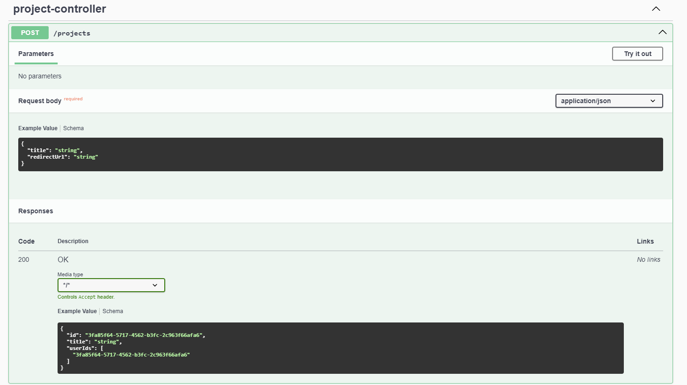
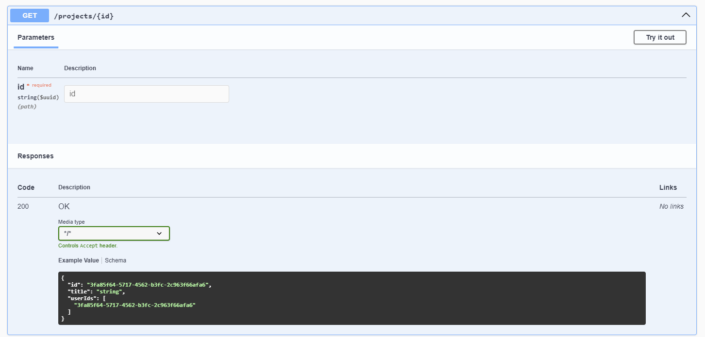
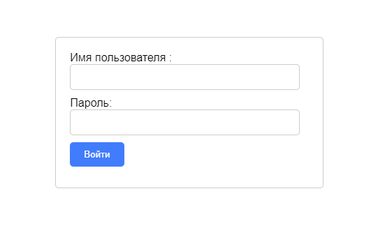
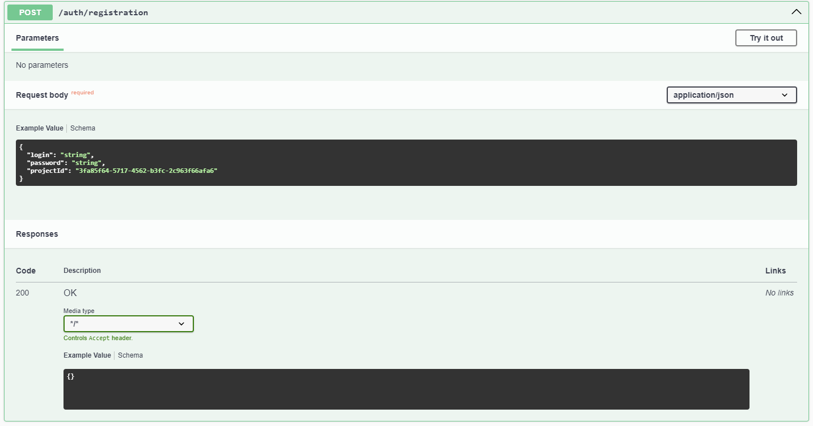
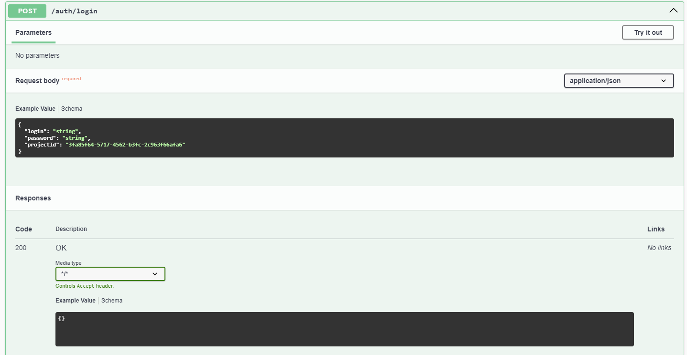
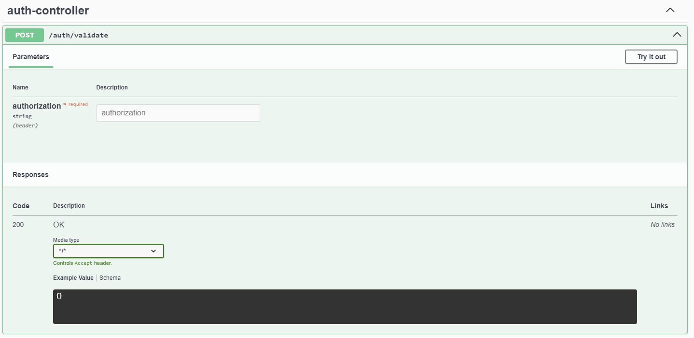
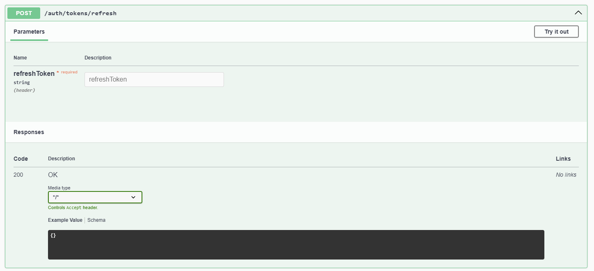
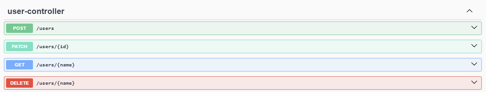
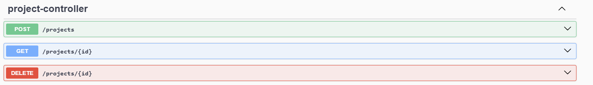

# Student-Auth-Service
Сервис авторизации для проектного практикума
Для сценариев логина и регистрации потребуется id проекта
- пользователь привязан к конкретному проекту
1) Завести проект или проверить его существование по id
   
   

# 1.Сценарий регистрации
1) Редиректнуть пользователя на страницу регистрации https://app.korvalanni:8080/registration?appId={id}

2)Проверить статус пользователя с помощью

# 2.Сценарий логина
1) Редиректнуть пользователя на страницу логина https://app.korvalanni:8080/login?appId={id}

2)Проверить статус пользователя с помощью

3) При успешной авторизации получить пару access и refresh токенов

# 3. Механизм инвалидации и обновления токенов

# 4. CRUD операции над пользователем 
админка для разработчика проекта

# 5. CRD операции над проектом

